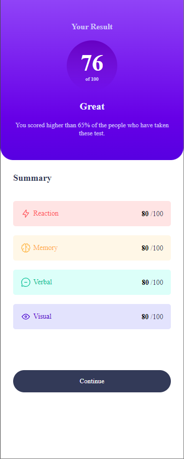
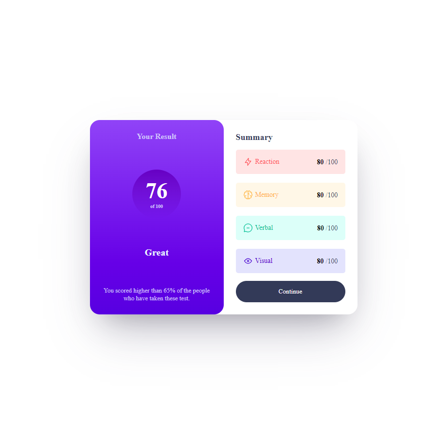

# Frontend Mentor - Profile card component solution

This is a solution to the [Profile card component challenge on Frontend Mentor](https://www.frontendmentor.io/challenges/profile-card-component-cfArpWshJ).

## Table of contents

- [Frontend Mentor - Profile card component solution](#frontend-mentor---profile-card-component-solution)
  - [Table of contents](#table-of-contents)
  - [Overview](#overview)
    - [The challenge](#the-challenge)
    - [Screenshot](#screenshot)
    - [Links](#links)
  - [My process](#my-process)
    - [Built with](#built-with)
    - [What I learned](#what-i-learned)
    - [Continued development](#continued-development)
    - [Useful resources](#useful-resources)
  - [Author](#author)

## Overview

### The challenge

- Build out the project to the designs provided

### Screenshot




### Links

- Solution URL: [Add solution URL here](https://your-solution-url.com)
- Live Site URL: [Add live site URL here](https://your-live-site-url.com)

## My process

- install sass compressor

```bash
npm install -g sass
```

- compile scss

```bash
sass --watch assets/styles/scss/style.scss assets/styles/css/style.css
```

### Built with

- Semantic HTML5 markup
- SCSS custom properties
- Flexbox
- CSS Grid
- Mobile-first workflow
- SASS

### What I learned

Using scss and BEM Methodolody

```html
<div class="circle">
  <span class="circle__number"> 76 </span>
  <span class="circle__total"> of 100 </span>
</div>
```

```css
@media screen and (max-width: $small) {
  body {
    .container {
      display: flex;
      flex-direction: column;
      justify-content: start;
      height: 100%;
      width: 100%;
      border-radius: 0px;
      &__left-side {
        border-radius: 0 0 25px 25px;
        flex-basis: 35%;
        width: 100%;
        justify-content: center;
        gap: 2vh;
      }
      &__right-side {
        justify-content: start;
        flex-basis: 60%;
        width: 100%;
        gap: 35px;
        height: 100%;
        .btn {
          align-self: self-end;
          margin-top: 5vh;
        }
      }
    }
  }
}
```

### Continued development

- i want to master responsive and using position in css
- i want to master mobile first

### Useful resources

- <https://en.bem.info/methodology/css/>

## Author

- Website - [marion](https://personnal-portfolio-react.vercel.app/)
- Frontend Mentor - [marion586](https://www.frontendmentor.io/profile/marion586)
- Linkedin - [@marionmenye](https://www.linkedin.com/in/rakotomandimby-marion-menye-08a186287/)
